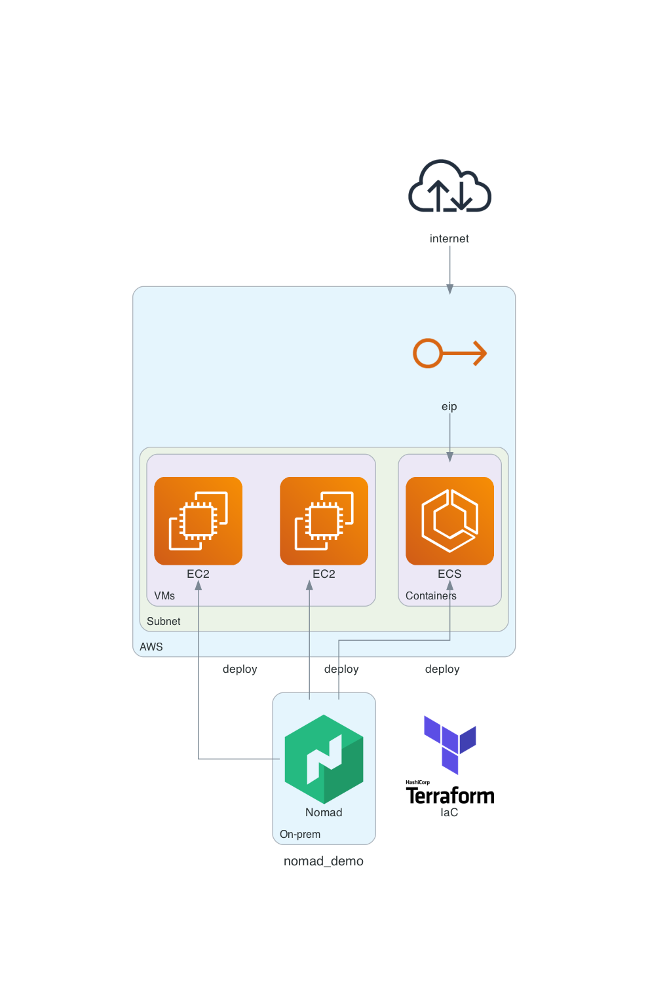

# Nomad Demo

## Tested Env

> Terraform > 0.12.0
> Nomad >= 1.1.0
> aws-iam-authenticator >= 0.5.0
> docker
> java

## Architecture

> Diagram : <./diagram>



- Nomad : External Nomad Server
- EC2 : Nomad Client

## Provisioning Nomad Cluster

- [Nomad Cluster Terraform](./terraform/amore-nomad-cluster)
- Terraform Cloud Backend
- If you want, change `terrform > cloud > workspace > name`
- Set up Terraform Cloud Worksapce `Remote state sharing` to share ECS Workspace (all or selected)

```bash
cd ./terraform/amore-nomad-cluster
terraform apply -auto-approve

# Create SSH Private Key
mkdir -p ./.ssh
terraform output ssh_private_key > ./.ssh/id_rsa
#If MAC OS 
sed -i "" '/EOT/d' ./.ssh/id_rsa
#If Windows
sed -i '/EOT/d' ./.ssh/id_rsa
chmod 600 ./.ssh/id_rsa

# Debug Client
ssh -i ./.ssh/id_rsa ubuntu@$(terraform output -json nomad_client_ips | jq -r '.[0]')
```

## Provisioning ECS Cluster

- [ECS Cluster](./terraform/amore-nomad-ecs)
- Terraform Cloud Backend
- If you want, change `terrform > cloud > workspace > name`

```bash
cd ./terraform/amore-nomad-ecs
terraform apply -auto-approve

terraform output sample_job
```


## Tear Down

```bash
cd ./terraform/amore-nomad-cluster
terraform destory -auto-approve

cd ../amore-nomad-ecs
terraform destory -auto-approve
```
